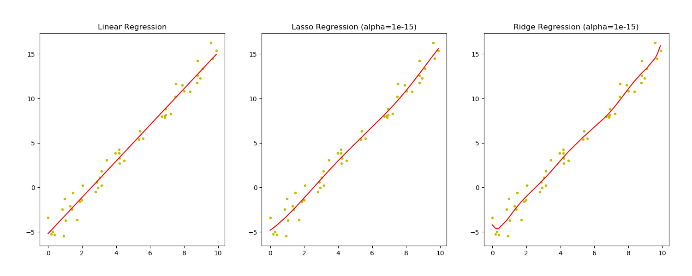

# Linear, Lasso vs Ridge Regression



```python
import pandas as pd
import numpy as np
import matplotlib.pyplot as plt

# data dummy
x = 10 * np.random.RandomState(1).rand(50)
x = np.sort(x)
# x = np.linspace(0, 10, 100)
print(x)
y = 2 * x - 5 + np.random.RandomState(1).randn(50)
# y = np.sin(x)
print(y)

# plot dummy data
# plt.scatter(x, y)
# plt.show()

# linear, lasso, ridge, polynomial, make_pipeline
from sklearn.linear_model import LinearRegression
from sklearn.linear_model import Lasso
from sklearn.linear_model import Ridge
from sklearn.preprocessing import PolynomialFeatures
from sklearn.pipeline import make_pipeline

# linear regression
modelLinear = LinearRegression()

# Pipeline: Polynomial + Lasso
modelLasso = make_pipeline(
    PolynomialFeatures(8),
    Lasso(alpha=1e-15, max_iter=1e5)
)

# Pipeline: Polynomial + Ridge
modelRidge = make_pipeline(
    PolynomialFeatures(8),
    Ridge(alpha=1e-15)
)

# training
modelLinear.fit(x.reshape(-1, 1), y)
modelLasso.fit(x.reshape(-1, 1), y)
modelRidge.fit(x.reshape(-1, 1), y)

# plot best fit line
fig = plt.figure('Regression', figsize=(15, 6))

# plot linear
plt.subplot(131)
plt.scatter(x, y, color='y', marker='.')
plt.plot(x, modelLinear.predict(x.reshape(-1, 1)), 'r-')
plt.title('Linear Regression')

# plot lasso
plt.subplot(132)
plt.scatter(x, y, color='y', marker='.')
plt.plot(x, modelLasso.predict(x.reshape(-1, 1)), 'r-')
plt.title('Lasso Regression (alpha=1e-15)')

# plot Ridge
plt.subplot(133)
plt.scatter(x, y, color='y', marker='.')
plt.plot(x, modelRidge.predict(x.reshape(-1, 1)), 'r-')
plt.title('Ridge Regression (alpha=1e-15)')

plt.show()
```

#

#### Lintang Wisesa :love_letter: _lintangwisesa@ymail.com_

[Facebook](https://www.facebook.com/lintangbagus) | 
[Twitter](https://twitter.com/Lintang_Wisesa) |
[Google+](https://plus.google.com/u/0/+LintangWisesa1) |
[Youtube](https://www.youtube.com/user/lintangbagus) | 
:octocat: [GitHub](https://github.com/LintangWisesa) |
[Hackster](https://www.hackster.io/lintangwisesa)